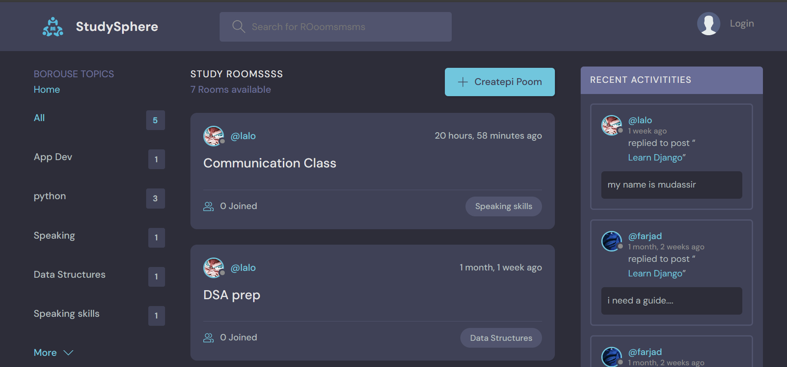
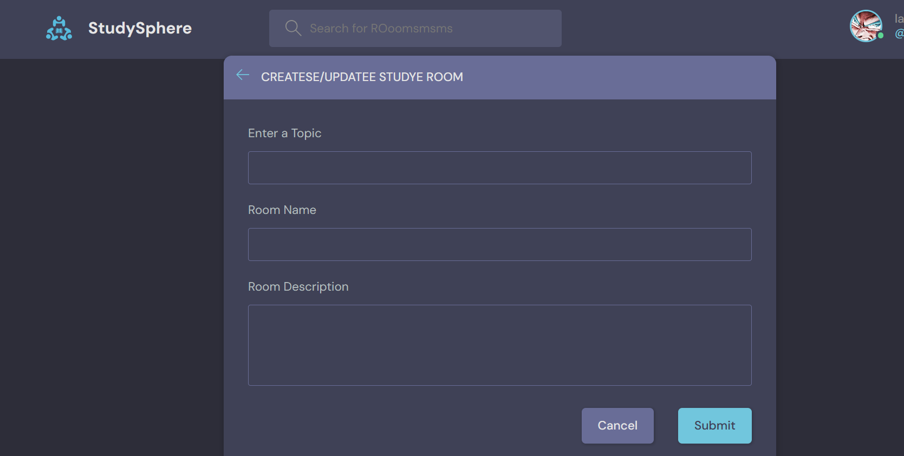
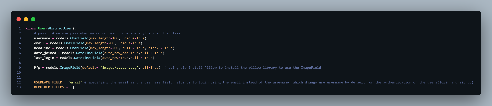

# StudySphere-Django
An amazing project made using Python's web Framework, Django.
The project includes custom user authentication and CRUD functionalities for managing chat rooms, topics, and messaging. The User Friendly comments in the code makes it readable and accessible for all the users.

<h3>Main Page</h3>
 
 
<h3>Creating a Room</h3>
 
 
<h3>Custom user Model</h3>
 

 
<h1>How to Get the Project?? Easy.... follow the below steps!!</h1>

## Install Git
Install git and setup in your computer. Download and install it from [here](https://git-scm.com/downloads).
Or you can make changings on the GitHub too.

## Clone the repository

Now clone the forked repository to your machine. Go to your GitHub account, open the forked repository, click on the code button and then click the _copy to clipboard_ icon.

Open a terminal and run the following git command:

```
git clone 'url_you_just_copied'
```
where `url_you_just_copied` is the url to this repository (your fork of this project). See the previous steps to obtain the url.

For example:

```
git clone https://github.com/your-username/ChatRooms_Django.git
```

Congratulations! you have cloned the project and you can now make your own project by following this project.


